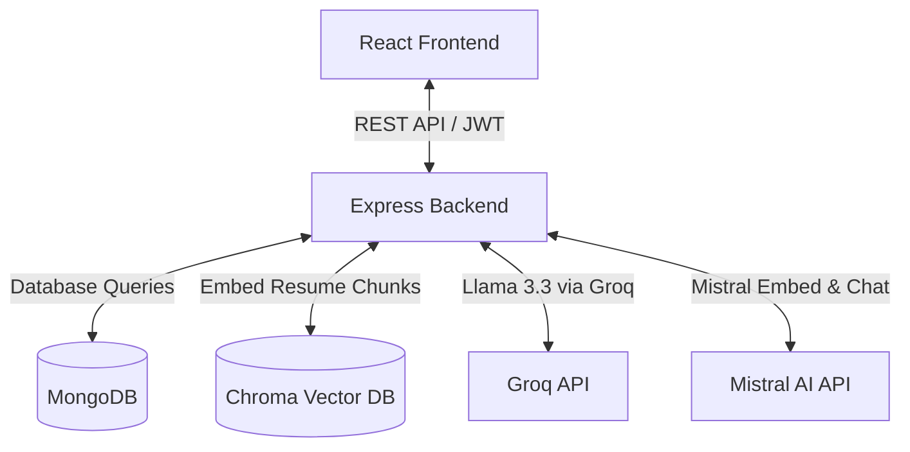
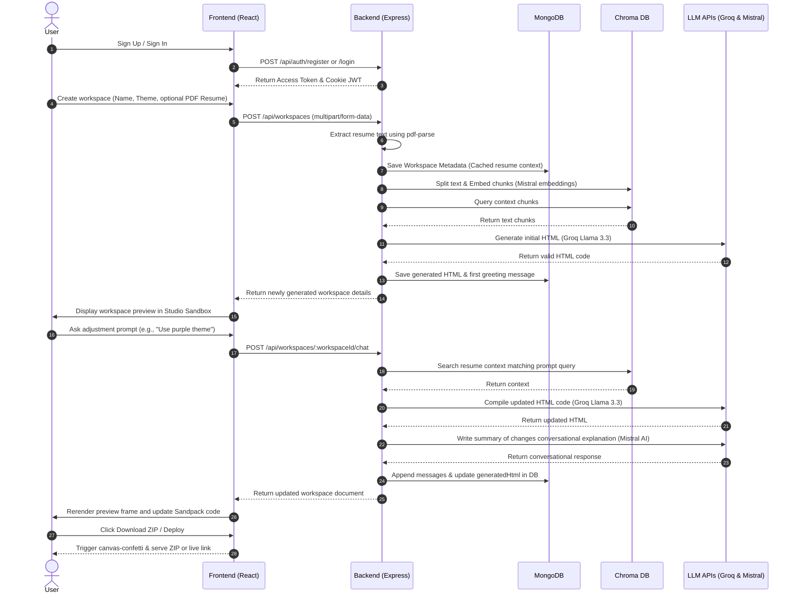

# AI Portfolio Builder

An automated, AI-powered platform designed to generate, customize, and deploy premium developer portfolios in seconds. By parsing raw PDF resumes and accepting real-time chat prompts, the system compiles beautiful responsive single-page showcases.

---

## 🏗️ Architecture & Flow

The application is structured as a decoupled full-stack architecture:



## 🔄 User & System Workflow

The step-by-step lifecycle of a project workspace within the platform is visualized and explained below:



1. **Authentication**: Users register or authenticate through standard credential sign-ins or Google Client OAuth tokens.
2. **Workspace Creation**: The user inputs a project title, uploads a PDF resume (optional), and selects preferred themes and ATS formats.
3. **Parsing & Vectorization**: The backend processes PDF buffer contents with `pdf-parse`, segments text into overlapping blocks, generates vector embeddings with Mistral AI, and indexes them in Chroma DB.
4. **Initial Code Generation**: Context chunks matching index terms are retrieved. The system prompts ChatGroq (Llama 3.3) to output a complete initial HTML portfolio document which is stored directly in MongoDB.
5. **Interactive Customization**: When a prompt is submitted from the Studio, the backend executes semantic retrieval from Chroma, compiles code updates using ChatGroq, and gets a conversational summary of changes using ChatMistralAI before updating MongoDB and return documents.
6. **Deployment & Export**: The user is enabled to download local source files as a ZIP package or deploy the portfolio instantly to a live server.

---

## 📁 File Structure

```text
Portfolio_builder/
├── backend/
│   ├── AI/
│   │   ├── create_db.js         # Vector store manager
│   │   └── main.js              # LLM pipelines & prompt handlers
│   ├── controllers/
│   │   ├── authControllers.js   # User registration, login, token refreshing
│   │   └── workspaceController.js# Portfolios management controllers
│   ├── models/
│   │   ├── user.js              # User database schema
│   │   └── workspace.js         # Workspace & message schemas
│   ├── routes/
│   │   ├── authRoutes.js        # Authentication API paths
│   │   └── workspaceRoutes.js   # Portfolios API paths
│   ├── authConfig.js            # JWT access & refresh token helpers
│   ├── check_db.js              # CLI inspection database utility
│   ├── connect.js               # MongoDB connection wrapper
│   ├── index.js                 # App server config
│   └── middleware.js            # Route authorization checks
└── frontend/
    ├── src/
    │   ├── app/
    │   │   ├── reducers/
    │   │   │   └── authReducers.js# Auth state slice
    │   │   └── store.js         # Redux store configuration
    │   ├── components/
    │   │   ├── ui/
    │   │   │   ├── Button.jsx   # Variant buttons
    │   │   │   ├── GoogleButton.jsx# Brand login button
    │   │   │   ├── InputField.jsx# Custom input wraps
    │   │   │   ├── Modal.jsx    # Popover overlay dialog
    │   │   │   └── NavBar.jsx   # Navigation & theme manager
    │   │   ├── AuthShell.jsx    # Authentication layout wrapper
    │   │   ├── ChatSidebar.jsx  # Studio prompting chat console
    │   │   ├── CreateWorkspaceForm.jsx# Creation configurations panel
    │   │   ├── SandboxViewport.jsx# Multi-tab preview & Code Editor
    │   │   └── WorkspaceGrid.jsx# Portfolios grid view
    │   ├── pages/
    │   │   ├── Dashboard.jsx    # Main user dashboard
    │   │   ├── Hero.jsx         # Landing promo page
    │   │   ├── Login.jsx        # Credentials/Google login
    │   │   ├── Profile.jsx      # Settings information panel
    │   │   ├── Signup.jsx       # Standard/OAuth registration
    │   │   └── Studio.jsx       # Split-pane AI editor workspace
    │   ├── App.jsx              # Routing & theme config
    │   ├── index.css            # Custom theme configurations
    │   └── main.jsx             # React mount, interceptors setup
    └── vite.config.js           # Vite config
```

---

## 📖 Complete Module & Function Directory

### 🖥️ Backend Modules

#### `backend/index.js`
App bootstrapper. Configures global CORS configurations, Express parses, and routes endpoints.

#### `backend/authConfig.js`
Authentication JWT generation helpers.
- **`generateAccessToken(user)`**: Generates short-lived (1 minute) Access JWTs containing the user’s ID and email.
- **`generateRefreshToken(user)`**: Generates long-lived (7 days) Refresh JWTs for automatic session extension.

#### `backend/check_db.js`
Inspects database status by printing all portfolios stored in the DB, their length, and a code block snippet.

#### `backend/connect.js`
Handles MongoDB connections.
- **`connectDB()`**: Configures mongoose connection to MongoDB using `process.env.MONGO_URI`.

#### `backend/middleware.js`
Express middleware handler.
- **`authMiddleware(req, res, next)`**: Decodes authorization Bearer headers, verifies validity of current Access JWT, and injects user profile payload.

#### `backend/AI/create_db.js`
Chroma Vector database manager.
- **`initializeVectorStore(text, userId, workspaceId)`**: Recursively splits resume file text, attaches metadata tags, generates vector embeddings using Mistral AI, and stores it in the local Chroma database.

#### `backend/AI/main.js`
AI Generation orchestrators.
- **`extractHtml(text)`**: Helper function to find, extract, and clean target `html` or `xml` markdown code blocks from model outputs.
- **`generateInitialPortfolio(workspaceId)`**: Queries the Vector DB for resume content, applies layout tokens, and requests Groq LLM (Llama 3.3) to generate a portfolio mockup.
- **`updatePortfolioWithChat(workspaceId, userMessageText)`**: Gathers message context (last 10 messages), fetches vector db blocks, updates HTML using ChatGroq, explains updates using ChatMistralAI, and saves state to Mongo.
- **`runRAGPipeline()`**: Interactive terminal demo interface.

#### `backend/controllers/authControllers.js`
Authentication controller methods.
- **`register(req, res)`**: Hashes credentials using bcrypt and creates database profiles.
- **`login(req, res)`**: Authenticates email/password combinations and sets the refresh token cookie.
- **`refresh(req, res)`**: Inspects refresh token cookie and distributes fresh short-term Access JWT.
- **`googleLogin(req, res)`**: Decodes, validates Google Client OAuth ticket, signs up/logs in matching profile, and sets JWT cookies.
- **`logout(req, res)`**: Deletes session cookie keys.

#### `backend/controllers/workspaceController.js`
Portfolio and studio management methods.
- **`getWorkspaces(req, res)`**: Lists all workspaces owned by the user.
- **`createWorkspace(req, res)`**: Parses PDF resume buffer text (using `pdf-parse`), initializes vector index, triggers initial RAG pipeline generation, and saves the workspace.
- **`getWorkspace(req, res)`**: Fetches details for a specific workspace.
- **`deleteWorkspace(req, res)`**: Deletes a specific workspace.
- **`chatInWorkspace(req, res)`**: Directs user instruction to the update pipeline and returns modified documents.

---

### 🎨 Frontend Modules

#### `frontend/src/main.jsx`
Sets up axios response interceptors to automatically handle token refreshing on 401 response statuses, retrying requests seamlessly.

#### `frontend/src/App.jsx`
Handles route mounting (`react-router-dom`) and controls global dark mode stylesheet toggles using document elements.

#### `frontend/src/app/reducers/authReducers.js`
Redux slice actions:
- **`login(state, action)`**: Saves user metadata and tokens in state and local storage.
- **`logout(state)`**: Clears store properties and deletes local storage entries.

#### `frontend/src/components/AuthShell.jsx`
Shared design shell layout for login/signup pages.

#### `frontend/src/components/ChatSidebar.jsx`
Interaction sidebar displaying historical user-prompt messages, loading skeletons, suggestions, and text input box.

#### `frontend/src/components/CreateWorkspaceForm.jsx`
Portfolio creator. Manages resume upload, name generation, template selection, and sends multipart requests.

#### `frontend/src/components/SandboxViewport.jsx`
Multi-tab workspace viewport:
- **Preview mode**: Displays the generated single-page portfolio code inside a sandboxed iframe using `srcDoc`.
- **Code Editor mode**: Sandpack static wrapper showing direct source code with syntax highlighting.

#### `frontend/src/components/WorkspaceGrid.jsx`
Visual grid lists showing user portfolios cards and create trigger.

#### `frontend/src/components/ui/`
- **`Button.jsx`**: Custom themed buttons.
- **`GoogleButton.jsx`**: Styled Google Sign-in button with brand vector graphics.
- **`InputField.jsx`**: Wrapped input field component.
- **`Modal.jsx`**: Animated popover dialog overlay.
- **`NavBar.jsx`**: Top header navigation bar (manages theme toggle and profile links).

#### `frontend/src/pages/`
- **`Hero.jsx`**: Platform marketing and showcase mockup page.
- **`Dashboard.jsx`**: Coordinates workspaces loading, listing, and modal creation triggers.
- **`Login.jsx`**: Connects credentials/OAuth login events.
- **`Signup.jsx`**: Connects email signup registration events.
- **`Profile.jsx`**: User profile parameters viewer.
- **`Studio.jsx`**: Studio layout that synchronizes sidebar prompts and Sandbox previews.
